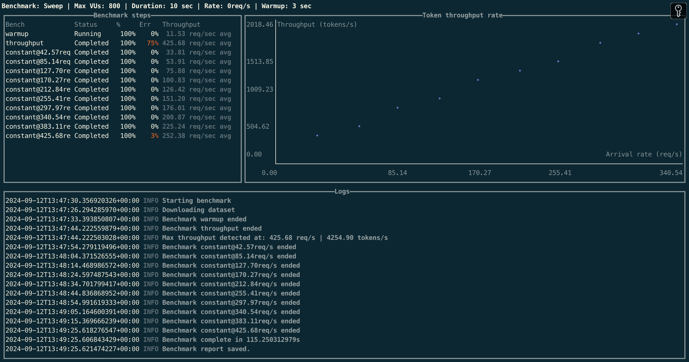

# Inference Benchmarker
**The best tool for benchmarking inference engines and LLM performance**


Benchmarking inference servers for text generation models presents unique challenges.
The performance of LLM models can vary greatly depending on factors like input prompts,
decoding strategies, hardware specifications, and server configurations.

**Inference Benchmarker** is designed to streamline this process by providing a comprehensive benchmarking tool
that evaluates the real-world performance of text generation models and servers.
With **Inference Benchmarker**, you can easily test your model's throughput and efficiency under various workloads,
identify performance bottlenecks, and optimize your deployment for production environments.

It can be used to benchmark any text generation server that exposes an OpenAI-compliant API.

## Features

* Broad Compatibility: Benchmarks any text generation server with an OpenAPI-compliant chat API.
* Automatic Sweep Mode: Detects maximum throughput and sweeps in-between.
* Open-Loop Benchmarking: Uses constant arrival rates to simulate real-world workloads.
* Benchmark profiles: Presets to benchmark for different model use cases (eg. chat, summarization, code completion...).
* High-Performance: Built with Rust 🦀 for high-performance benchmarking.
* JSON Output: Delivers performance results in a structured, easy-to-analyze format.



## Table of contents

<!-- TOC -->
* [Inference Benchmarker](#inference-benchmarker)
  * [Features](#features)
  * [Table of contents](#table-of-contents)
  * [Get started](#get-started)
    * [Run a benchmark](#run-a-benchmark)
      * [1. Start an inference server](#1-start-an-inference-server)
      * [2. Run a benchmark using Docker image](#2-run-a-benchmark-using-docker-image)
    * [Configure your benchmark](#configure-your-benchmark)
      * [Profiles](#profiles)
      * [Benchmark mode](#benchmark-mode)
      * [Dataset configuration](#dataset-configuration)
      * [Prompt configuration](#prompt-configuration)
    * [Decode options](#decode-options)
  * [Deploy on Kubernetes](#deploy-on-kubernetes)
  * [Deploy on Slurm](#deploy-on-slurm)
  * [Visualize the results](#visualize-the-results)
  * [Development](#development)
  * [Frequently Asked Questions](#frequently-asked-questions)
<!-- TOC -->

## Get started

### Install

If you have [cargo](https://rustup.rs/) already installed:
```bash
cargo install --git https://github.com/huggingface/inference-benchmarker/
```

Or download the [latest released binary](https://github.com/huggingface/inference-benchmarker/releases/latest)

Or you can run docker images.

### Run a benchmark

#### 1. Start an inference server

**TGI**

```bash
MODEL=meta-llama/Llama-3.1-8B-Instruct
HF_TOKEN=<your HF READ token>

docker run --gpus all --shm-size 1g -p 8080:80 -e "HF_TOKEN=$HF_TOKEN" \
    ghcr.io/huggingface/text-generation-inference:3.2.1 --model-id $MODEL
```

**vLLM**

```bash
MODEL=meta-llama/Llama-3.1-8B-Instruct
HF_TOKEN=<your HF READ token>
docker run --runtime nvidia --gpus all \
    --env "HUGGING_FACE_HUB_TOKEN=$HF_TOKEN" \
    -p 8080:8000 \
    --ipc=host \
    vllm/vllm-openai:latest \
    --model $MODEL
```


#### 2. Run a benchmark

```shell
inference-benchmarker
    --tokenizer-name "meta-llama/Llama-3.1-8B-Instruct" \
    --url http://localhost:8080 \
    --profile chat
```

Results will be saved in JSON format in current directory.

### Configure your benchmark

#### Profiles

Profiles are presets to benchmark for different model use cases. Available profiles:
- `chat`
  Simulates a multi-turn chat scenario in which the model answers to successive user prompts.
  The model is prompted with the whole conversation history at each turn. Prefix caching will have a significant impact
  on the performance of this benchmark.
- `code-generation`
  Simulates code-complete scenarios. Model is given large code snippets and asked to complete them with a few tokens 
  (e.g. a function name, a few code lines).
- `classification`
  Simulates cases where the model is fed with large chunks of business data or document repeatedly and users
  ask simple questions about the content (summarization, classification...).
  Those use cases benefit a lot from prefix caching and chunked prefill.
- `fixed-length`
  Model is sent fixed-length prompts to void the impact of variable-length tokenization on the benchmark.
  This is a technical benchmark to evaluate the raw throughput of the model.

#### Benchmark mode

In default mode, tool runs a `sweep` benchmark. It first runs a throughput test to find the maximum throughput, then
sweeps on QPS values up to the maximum throughput.

Available modes:

- `sweep`: runs a sweep benchmark
- `rate`: runs a benchmark at a fixed request rate
- `throughput`: runs a benchmark at a fixed throughput (constant VUs)

Example running a benchmark at a fixed request rates:

```shell 
inference-benchmarker \
    --tokenizer-name "meta-llama/Llama-3.1-8B-Instruct" \
    --max-vus 800 \
    --duration 120s \
    --url http://localhost:8080 \
    --warmup 30s \
    --benchmark-kind rate \
    --rates 1.0 \
    --rates 5.0 \
    --rates 10.0 \
    --prompt-options "num_tokens=200,max_tokens=220,min_tokens=180,variance=10" \
    --decode-options "num_tokens=200,max_tokens=220,min_tokens=180,variance=10"
```

#### Dataset configuration

Prompts are sampled for a Hugging Face dataset file, using a [subset of ShareGPT
as default](https://huggingface.co/datasets/hlarcher/share_gpt_small). You can specify a different dataset file using
the
`--dataset` and `--dataset-file` option.

Dataset is expected to be JSON with the following format:

```json
[
  {
    "conversations": [
      {
        "role": "user",
        "content": "rewrite that entire paragraph in the same style like this one: "
      }
    ]
  }
]
```

To benchmark with prefix caching, you can use a system prompt that will be sent with each request from a discussion.

```json
[
  {
    "conversations": [
      {
        "role": "system",
        "content": "You are a helpful assistant that makes jokes at each response."
      },
      {
        "role": "user",
        "content": "rewrite that entire paragraph in the same style like this one:"
      }
    ]
  }
]
```

#### Prompt configuration

For consistent results you can configure the token count and variance. The tool will sample prompts with the specified
values, sampling token counts from a normal distribution with the specified variance.

```shell
--prompt-options "num_tokens=50,max_tokens=60,min_tokens=40,variance=10"
```

### Decode options

You can also configure the decoding options for the model. The tool will sample decoding options with the specified
values, sampling token counts from a normal distribution with the specified variance.

```shell
--decode-options "num_tokens=50,max_tokens=60,min_tokens=40,variance=10"
```

## Deploy on Kubernetes

You can deploy the benchmarking tool on Kubernetes using the provided Helm chart.

Review the values (especially model, HF token and resources), and install the chart:
```shell
$ helm install inference-benchmarker ./extra/k8s/inference-benchmarker
```

## Deploy on Slurm

Slurm example is provided in `extra/slurm`.

## Visualize the results

You can use the provided Gradio app to quickly visualize the results.
Considering that JSON results files are in `/path/to/results/dir`:
```shell
$ poetry install
$ cd extra/dashboard
$ poetry run python app.py --from-results-dir /path/to/results/dir
```


## Development

You need [Rust](https://rustup.rs/) installed to build the benchmarking tool.

```shell
$ make build
```

## Frequently Asked Questions

* **What's the difference between constant arrival rate and constant virtual user count?**
    * **Constant virtual user count** means that the number of virtual users is fixed. Each virtual user can send a
      single requests and waits for server response. It's basically simulating a fixed number of users querying the
      server.
    * **Constant arrival rate** means that the rate of requests is fixed and the number of virtual users is adjusted to
      maintain that rate. Queries hit the server independently of responses performances.

  **Constant virtual user count** is a closed loop model where the server's response time dictates the number of
  iterations. **Constant arrival rate** is an open-loop model more representative of real-life workloads.


* **Why do I get high error rate when running `thoughput` benchmark?**

  Throughput bench tries to saturate the server with a high request rate. The error rate is high because the server is
  not able to handle the request rate or rate limiting the requests.
  In the case of TGI, this is controlled by the `--max-concurrent-requests` option.


* **What is the influence of CUDA graphs?**

  CUDA graphs are used to optimize the GPU usage by minimizing the overhead of launching kernels. This can lead to
  better performance in some cases, but can also lead to worse performance in others.
  If your CUDA graphs are not evenly distributed, you may see a performance drop at some request rates as batch size may
  fall in a bigger CUDA graph batch size leading to a lost of compute due to excessive padding.

* **I get less tokens generated than expected in a benchmark.**

  Inference servers use `max_tokens` parameter to limit the number of tokens generated. If the model
  generates an end-of-sequence token before reaching `max_tokens`, the generation will stop.
  There is currently no way to guarantee a fixed number of tokens generated without modifying the inference server.
  So you may have `(successful requests) * max_tokens < generated tokens`.

